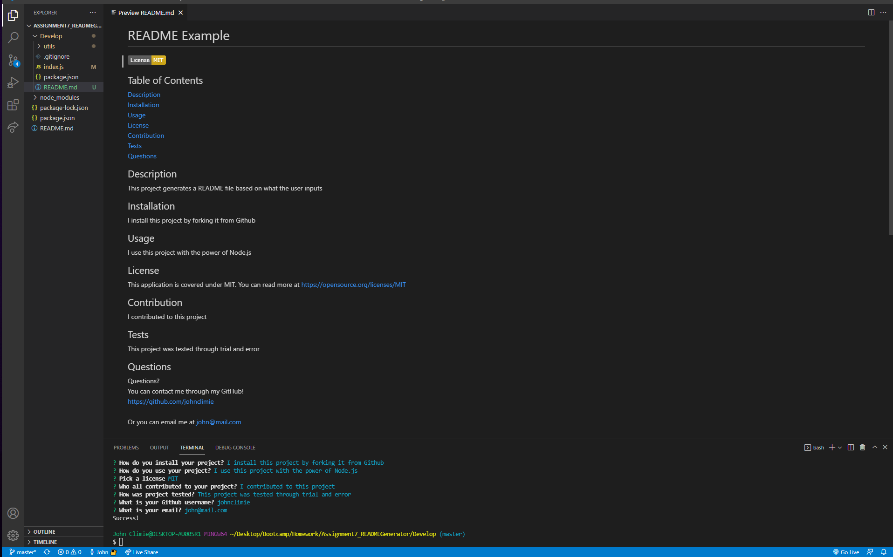

# README Generator

## Description

In this project, I created a README generator.

I made it with the starting files provided to me. I completed several funcitons, that would take input from the user and output onto the README file. The user inputs by invoking the index.js file through node.js

Overall, this project was somewhat difficult, as I had to learn how to use NPM's in order to get my project to work. However, I enjoyed the project, as it was something refreshing as I got to work with JavaScript outside of a web browser.

**Links**

YouTube Demonstration: https://youtu.be/OGwGBelzz1U 
GitHub Repository: https://github.com/johnclimie/READMEGenerator 